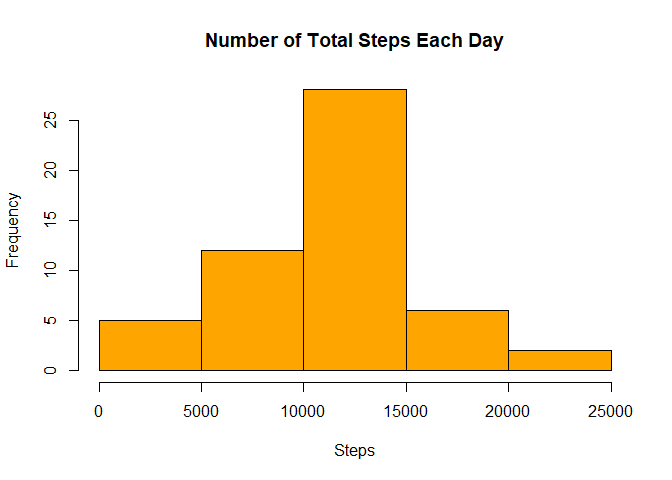
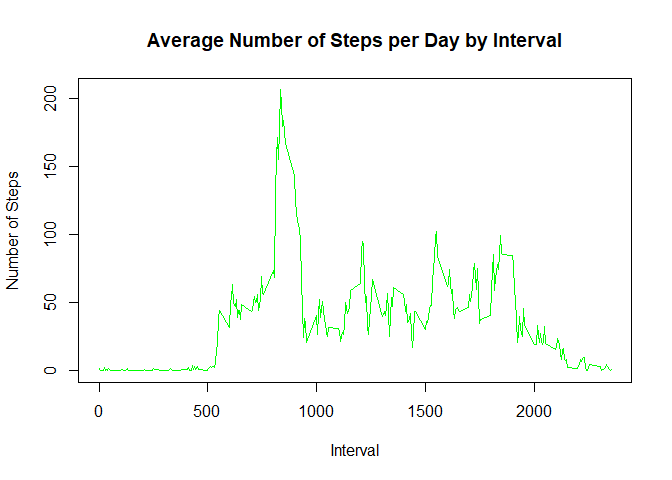
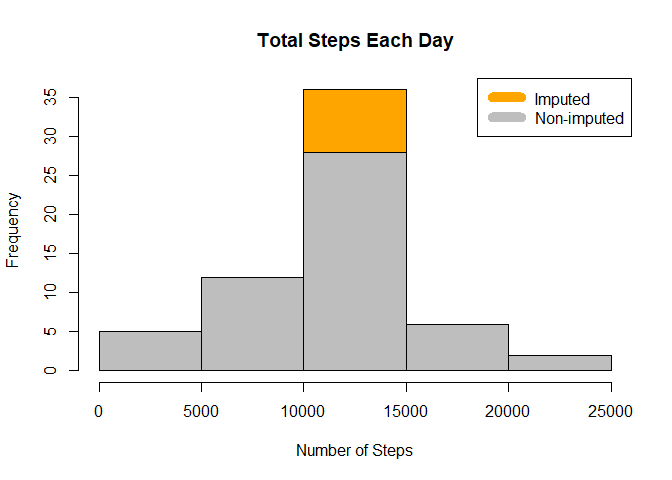

Course Project 
---------------------------


## Step 1 - rading data


```r
if (!file.exists("activity.csv") )
{
  dlurl <- 'http://d396qusza40orc.cloudfront.net/repdata%2Fdata%2Factivity.zip'  
  download.file(dlurl,destfile='repdata%2Fdata%2Factivity.zip',mode='wb')  
  unzip('repdata%2Fdata%2Factivity.zip')
}

# Read data
data <- read.csv("activity.csv") 

summary(data)
```

```
##      steps                date          interval     
##  Min.   :  0.00   2012-10-01:  288   Min.   :   0.0  
##  1st Qu.:  0.00   2012-10-02:  288   1st Qu.: 588.8  
##  Median :  0.00   2012-10-03:  288   Median :1177.5  
##  Mean   : 37.38   2012-10-04:  288   Mean   :1177.5  
##  3rd Qu.: 12.00   2012-10-05:  288   3rd Qu.:1766.2  
##  Max.   :806.00   2012-10-06:  288   Max.   :2355.0  
##  NA's   :2304     (Other)   :15840
```

## Step 2 - Histogram of the total number of steps taken each day


```r
steps_by_day <- aggregate(steps ~ date, data, sum)
hist(steps_by_day$steps, main = paste("Number of Total Steps Each Day"), col="orange",xlab="Steps")
```

<!-- -->


### Step  3 - Mean and median number of steps taken each day 

Mean number of steps


```r
meanSteps <- mean(steps_by_day$steps)
meanSteps
```

```
## [1] 10766.19
```

Median number of steps


```r
medianSteps <- median(steps_by_day$steps)
medianSteps
```

```
## [1] 10765
```

### Step 4 - Time series plot of the average number of steps taken


```r
steps_by_interval <- aggregate(steps ~ interval, data, mean)
plot(steps_by_interval$interval,steps_by_interval$steps, type="l", xlab="Interval", ylab="Number of Steps",main="Average Number of Steps per Day by Interval",col="green")
```

<!-- -->

### Step 5  - The 5-minute interval that, on average, contains the maximum number of steps


```r
max_steps <- steps_by_interval[which.max(steps_by_interval$steps),1]
max_steps
```

```
## [1] 835
```

### Step 6 - Code to describe and show a strategy for imputing missing data


```r
NA_in_data <- sum(!complete.cases(data))
NA_in_data
```

```
## [1] 2304
```

```r
StepsAverage <- aggregate(steps ~ interval, data = data, FUN = mean)
fillNA <- numeric()
for (i in 1:nrow(data)) {
    obs <- data[i, ]
    if (is.na(obs$steps)) {
        steps <- subset(StepsAverage, interval == obs$interval)$steps
    } else {
        steps <- obs$steps
    }
    fillNA <- c(fillNA, steps)
}
```


### Step 7 - Histogram of the total number of steps taken each day after missing values are imputed


```r
data_fillNa <- data
data_fillNa$steps <- fillNA


StepsTotalUnion <- aggregate(steps ~ date, data = data_fillNa, sum, na.rm = TRUE)
hist(StepsTotalUnion$steps, main = paste("Total Steps Each Day"), col="orange", xlab="Number of Steps")
#Create Histogram to show difference. 
hist(steps_by_day$steps, main = paste("Total Steps Each Day"), col="gray", xlab="Number of Steps", add=T)
legend("topright", c("Imputed", "Non-imputed"), col=c("orange", "gray"), lwd=10)
```

<!-- -->


### Step 8 - Panel plot comparing the average number of steps taken per 5-minute interval across weekdays and weekends


```r
weekdays <- c("Monday", "Tuesday", "Wednesday", "Thursday", "Friday")
data_fillNa$dow = as.factor(ifelse(is.element(weekdays(as.Date(data_fillNa$date)),weekdays), "Weekday", "Weekend"))
StepsTotalUnion <- aggregate(steps ~ interval + dow, data_fillNa, mean)
library(lattice)
xyplot(StepsTotalUnion$steps ~ StepsTotalUnion$interval|StepsTotalUnion$dow, main="Average Steps per Day by Interval",xlab="Interval", ylab="Steps",layout=c(1,2), type="l")
```

<!-- -->
